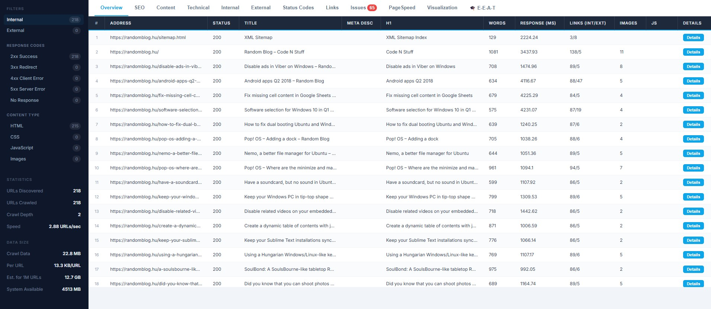
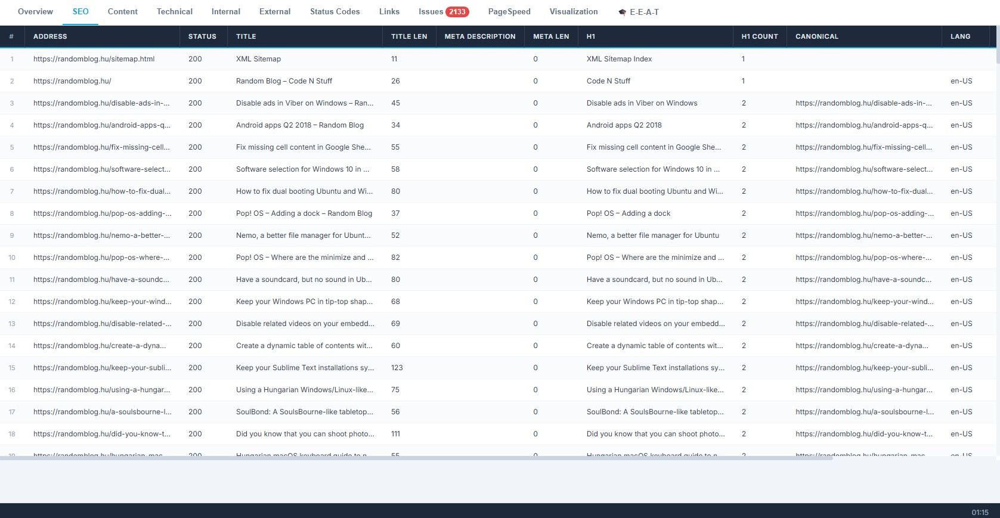
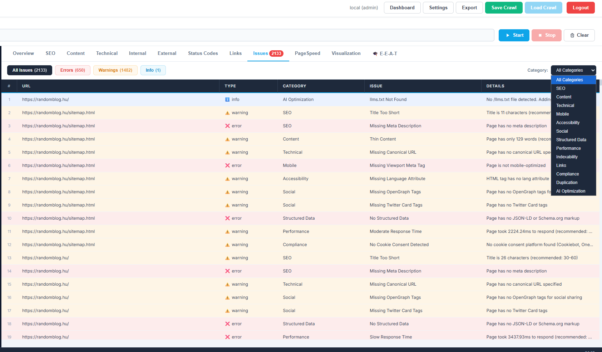
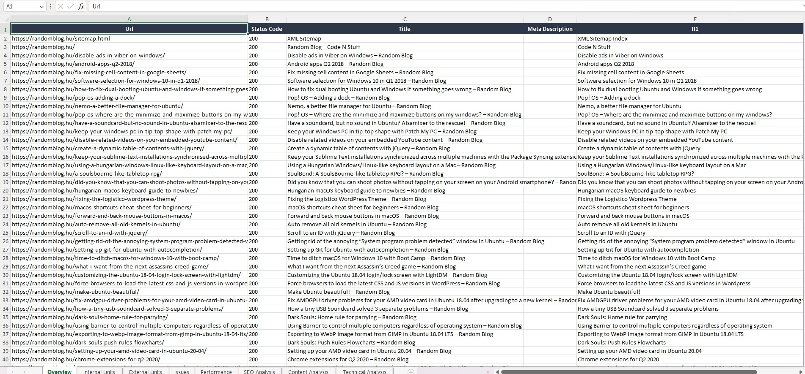

# NovaCrawl

**A professional, open-source SEO crawler and site auditing tool built in Python.**

NovaCrawl crawls any website and produces a full technical SEO audit — broken links, missing metadata, duplicate content, orphan pages, heading structure issues, AI/LLM compliance checks, and more — exportable as a multi-sheet Excel report.

---

## Screenshots






---

## Features

### Crawling
- Multi-threaded crawler with configurable depth, speed, and concurrency
- JavaScript rendering via Playwright (for SPAs and dynamic pages)
- Sitemap discovery and parsing
- Proxy support with custom headers
- Always respects `robots.txt`

### SEO Analysis (per page)
- Title tag — presence, length, uniqueness across site
- Meta description — presence, length, uniqueness across site
- H1 tags — presence, multiple H1 detection, title vs H1 mismatch
- Heading hierarchy — detects skipped levels (e.g. H1 to H3 without H2)
- Canonical URL validation
- Open Graph and Twitter Card tags
- JSON-LD / Schema.org structured data detection
- Hreflang tags
- Viewport and language attributes
- Analytics tracking detection (GA4, GTM, Facebook Pixel, Hotjar)
- Image alt text coverage
- Content freshness via `article:published_time` (flags articles older than 12 months)
- Redirect chain depth detection (3+ hop chains flagged)
- Cookie consent platform detection (Cookiebot, OneTrust, TrustArc, and more)
- Flesch readability scoring per page
- Response time and page size

### Cross-Page Analysis (post-crawl)
- Duplicate title tags across all pages
- Duplicate meta descriptions across all pages
- Duplicate H1 tags across all pages
- Orphan page detection (zero inbound internal links)
- Broken internal link source detection (which pages link to 404s)
- Content similarity detection (configurable threshold)

### AI & Compliance Checks
- `llms.txt` presence check — flags if the site hasn't defined AI crawler access rules
- AI bot blocking detection in `robots.txt` (GPTBot, ClaudeBot, PerplexityBot)

### Dashboard Tabs
- **Overview** — 12-column summary of all crawled URLs
- **SEO** — title length, meta length, H1 count, canonical, lang, OG/JSON-LD counts
- **Content** — word count, readability score, H1 count, content type
- **Technical** — response time, size, depth, redirect chain, cookie consent, analytics
- **Internal Links** — every internal link with source, target, anchor, status
- **External Links** — deduplicated external link targets with link count
- **Issues** — filterable by severity (error / warning / info) and category
- **Performance** — PageSpeed Insights integration (Google API key required)
- **E-E-A-T** — Experience, Expertise, Authoritativeness, Trust signal analysis (plugin)
- **Visualization** — site link graph

### Issues Categories
Issues tab can be filtered by: SEO, Content, Technical, Mobile, Accessibility, Social, Structured Data, Performance, Indexability, Links, Compliance, Duplication, AI Optimization

### Reporting & Export
- **Multi-sheet Excel export (.xlsx)** with 8 sheets:
  - Overview, Internal Links, External Links, Issues, Performance
  - SEO Analysis, Content Analysis, Technical Analysis
- CSV, JSON, and XML export also supported
- Export filenames use the crawled domain (e.g. `example.com_NovaCrawl_20260517_report.xlsx`)

### Other
- Internal save/load system — save crawl sessions and restore them later, with custom filenames
- Virtual scrolling — handles 100k+ URL crawls without performance issues
- Cell tooltips — truncated cells show full content on hover
- Plugin system for custom analysis (E-E-A-T plugin included)
- Link visualization graph

---

## Requirements

- Python 3.9 or higher
- pip

---

## Installation

```bash
git clone https://github.com/SArfrz/NovaCrawl.git
cd NovaCrawl
pip install -r requirements.txt
```

For JavaScript rendering support (optional — needed for SPAs and dynamic pages):

```bash
playwright install chromium
```

---

## Usage

```bash
python main.py
```

Opens the app in your browser at `http://localhost:5000`. No login required by default.

### Command line options

```
--local           Run without login, all users get admin access (default for local use)
--disable-guest   Disable guest access
--demo            Demo mode with 1.5GB memory limit per user
```

---

## Configuration

Copy `.env.example` to `.env` and edit as needed:

```bash
cp .env.example .env
```

Key settings:

| Variable | Default | Description |
|---|---|---|
| `HOST_BINDING` | `127.0.0.1` | Bind address — use `0.0.0.0` to expose on network |
| `LOCAL_MODE` | `true` | Skip login for local single-user use |
| `SMTP_HOST` | — | SMTP server for email verification (multi-user mode only) |

All crawler settings (depth, concurrency, delay, proxy, JavaScript rendering, filters, export format) are configurable from the in-app Settings panel.

> **Note:** Respect for `robots.txt` is always enforced and cannot be disabled in this build.

---

## Project Structure

```
NovaCrawl/
├── main.py                      # Flask app, all API routes, entry point
├── requirements.txt
├── .env.example
├── src/
│   ├── crawler.py               # Core crawl orchestrator (multi-threaded)
│   ├── auth_db.py               # User auth and settings persistence (SQLite)
│   ├── crawl_db.py              # Crawl history and resume support
│   ├── settings_manager.py      # Per-user settings with tier access control
│   ├── email_service.py         # Email verification (multi-user mode)
│   └── core/
│       ├── seo_extractor.py     # HTML metadata extraction
│       ├── issue_detector.py    # Per-page and cross-page issue detection
│       ├── link_manager.py      # Link discovery and graph building
│       ├── js_renderer.py       # Playwright-based JS rendering
│       ├── sitemap_parser.py    # Sitemap discovery and parsing
│       ├── rate_limiter.py      # Smooth token-bucket rate limiting
│       └── memory_monitor.py    # Real-time memory usage tracking
└── web/
    ├── templates/               # Flask Jinja2 templates
    └── static/
        ├── css/styles.css
        └── js/
            ├── app.js               # Main UI and crawl state management
            ├── virtual-scroller.js  # Virtual DOM for large result sets
            ├── incremental_poller.js
            ├── settings.js
            ├── dashboard.js
            └── plugins/             # Plugin API + built-in plugins
                └── e-e-a-t.js       # E-E-A-T signal analysis plugin
```

---

## Tech Stack

| Layer | Technology |
|---|---|
| Backend | Python, Flask, Waitress |
| Crawling | requests, BeautifulSoup4, Playwright |
| Database | SQLite |
| Auth | bcrypt |
| Readability | textstat (Flesch scoring) |
| Export | openpyxl, csv, json, xml |
| Frontend | Vanilla JS, HTML, CSS |

---

## Contributing

Pull requests are welcome. For major changes please open an issue first to discuss what you would like to change.

See [CONTRIBUTING.md](CONTRIBUTING.md) for guidelines.

---

## License

MIT — see [LICENSE](LICENSE) for details.

---

*Built by [Sarfaraz](https://github.com/SArfrz)*
